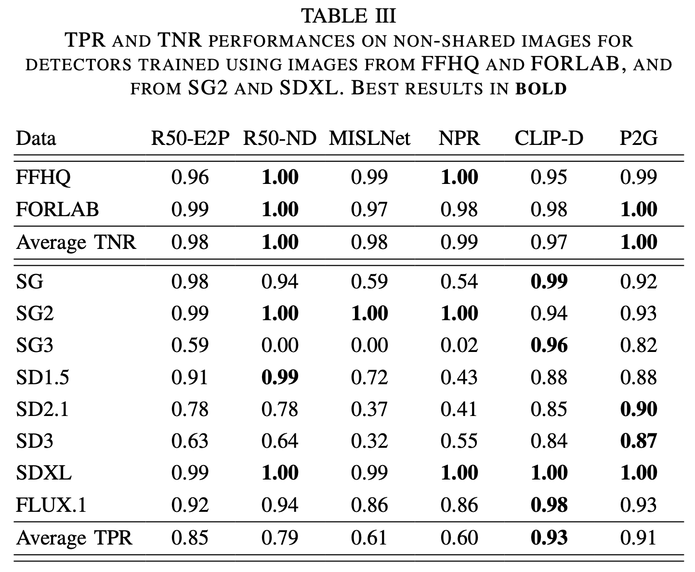
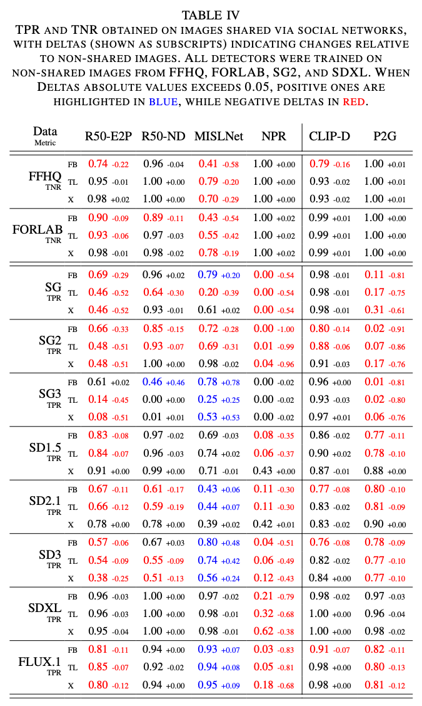

# TrueFake: A Real World Case Dataset of Last Generation Fake Images also Shared on Social Networks

This is the official code implementation of the "IJCNN 2025" paper ["TrueFake: A Real World Case Dataset of Last Generation Fake Images also Shared on Social Networks"](https://arxiv.org/abs/2504.20658)\
Authors: Stefano Dell'Anna, Andrea Montibeller, Giulia Boato 

## Abstract

<table>
<tbody>
<tr>
<td style="width:30%; vertical-align: top;"> AI-generated synthetic media are increasingly used in real-world scenarios, often with the purpose of spreading misinformation and propaganda through social media platforms, where compression and other processing can degrade fake detection cues. Currently, many forensic tools fail to account for these in-the-wild challenges. In this work, we introduce TrueFake, a large-scale benchmarking dataset of 600,000 images including top notch generative techniques and sharing via three different social networks. This dataset allows for rigorous evaluation of state-of-the-art fake image detectors under very realistic and challenging conditions. Through extensive experimentation, we analyze how social media sharing impacts detection performance, and identify current most effective detection and training strategies. Our findings highlight the need for evaluating forensic models in conditions that mirror real-world use.</td>
<td style="width:70%; vertical-align: top;">  ⠀⠀⠀⠀⠀⠀⠀⠀⠀⠀⠀⠀⠀⠀⠀⠀⠀⠀⠀⠀⠀⠀⠀⠀⠀⠀⠀⠀⠀⠀⠀⠀⠀⠀⠀⠀</td>
</tr>
</tbody>
</table>

# Dataset
The dataset is available at this [link](https://drive.usercontent.google.com/download?id=1og1cdczOspkQY3jF1m5sWNBc8X59h2e5)

# Prompts
In ```./prompts/``` we make available the prompts used for the generation of the dataset.\
in ```./prompts/src/``` we provide the scripts used to generate ```prompts_faces.txt```, ```prompts_animals.txt```, and ```prompts_landscapes.txt```.\
```prompts_general.txt``` is instead a subset of [sezenkarakus/image-description-dataset-v2](https://huggingface.co/datasets/sezenkarakus/image-description-dataset-v2).

# Detector

## Use pretrained network
The R50-E2P network was trained according to the information provided in the paper on a limited subset of non-shared data.\
If you plan on using the network for other purposes other than to replicate the results in the paper, you should re-train it on a more comprehensive subset.

Create directory with ```mkdir -p ./detector/train/gan2:pre&sdXL:pre&realFFHQ:pre&realFORLAB:pre/models/```.\
And put the [pretrained weigths](https://drive.usercontent.google.com/download?id=1m0b8HZuOCcF_-l2-GJBi3C22RuG5UDvU&export=download) inside, make sure that the file is named ```best.pt```.

## Set up Virtual-Env
```
conda env create -f environment.yml
```

## Run the code
Run the code inside ```./detector/```\
We suggest to use the provided launcher to automate training and test phases:
```
python launcher.py
```

Alternatively you can make individual calls using ```train.py``` and ```test.py```:
```
python train.py --name "gan2:pre&sdXL:pre&realFFHQ:pre&realFORLAB:pre" --split_file ./split.json --task train --num_threads 8 --data_keys "gan2:pre&sdXL:pre&realFFHQ:pre&realFORLAB:pre" --data_root DATASET_ROOT --device cuda:0 --arch nodown --prototype --freeze
python test.py --name "gan2:pre&sdXL:pre&realFFHQ:pre&realFORLAB:pre" --split_file ./split.json --task test --num_threads 8 --data_keys DATA_ID --data_root DATASET_ROOT --device cuda:0 --arch nodown --prototype --freeze
```
If you call ```train.py``` and ```test.py``` directly, you have to specify ```DATASET_ROOT``` in both and ```DATA_ID``` for the test code, according to [this guideline](detector/README.md).

# Results
Check [TrueFake: A Real World Case Dataset of Last Generation Fake Images also Shared on Social Networks](https://arxiv.org/abs/2504.20658)\

<table>
<tbody>
<tr>
<td style="width:50%; vertical-align: top;">  </td>
<td style="width:50%; vertical-align: top;">  </td>
</tr>
</tbody>
</table>

# Cite us
If you use this material please cite:

```
@misc{dellanna2025truefake,
      title={TrueFake: A Real World Case Dataset of Last Generation Fake Images also Shared on Social Networks}, 
      author={Stefano Dell'Anna and Andrea Montibeller and Giulia Boato},
      year={2025},
      eprint={2504.20658},
      archivePrefix={arXiv},
      primaryClass={cs.MM},
      url={https://arxiv.org/abs/2504.20658}, 
}
```
